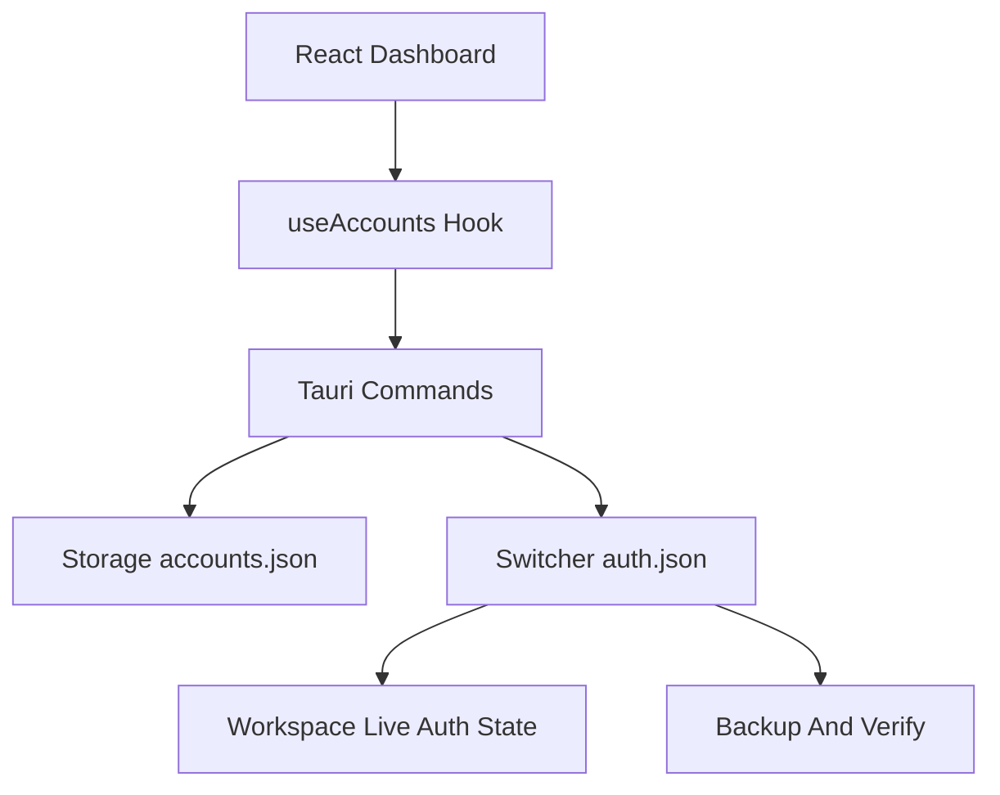

# 变更提案: gpt-account-switching-optimization

## 元信息
```yaml
类型: 优化
方案类型: implementation
优先级: P1
状态: 已完成
创建: 2026-04-14
```

---

## 1. 需求

### 背景
`codex-switcher` 已具备多账号导入、OAuth 登录、用量刷新和账号切换能力，但当前“账号切换”仍偏向基础可用：

- 当前激活态主要以 `accounts.json` 的 `active_account_id` 为准，缺少对真实 `~/.codex/auth.json` 的一致性校验。
- 切换流程直接写入 `auth.json`，没有显式备份、写后验证和失败回退，真实切换失败时用户难以及时察觉。
- UI 能看到“应用内 active”，但不容易判断“当前机器真实生效的是哪个账号”。
- 导入入口主要面向 OAuth 和外部文件，缺少把当前机器已有 Codex / ChatGPT 登录态快速纳入管理的入口。

### 目标
- 增强账号切换流程的事务性：切换前备份、切换后验证、失败时自动回退。
- 提供“真实工作区状态”视图，区分应用内活动账号与 `~/.codex/auth.json` 当前实际生效账号。
- 增加从当前机器现有 `auth.json` 快速导入账号的入口，降低首次接入成本。
- 优化主界面，使其更适合在多个 GPT / ChatGPT 账号之间快速比较、判断和切换。
- 将前端依赖管理从 `pnpm` 迁移到 `bun`，后续统一使用 `bun` 安装、运行和构建前端依赖。
- 补充 README，说明推荐使用方式、切换安全机制和典型操作路径。

### 约束条件
```yaml
时间约束: 当前迭代内完成，不引入额外服务端依赖
性能约束: 常规列表加载和切换状态查询应保持本地即时响应；用量刷新继续维持现有并发模型
兼容性约束: 兼容现有 accounts.json 结构，避免破坏已保存账号；继续兼容 API Key 与 ChatGPT OAuth 两类认证
业务约束: 仅服务于用户本人合法拥有的多个 OpenAI / ChatGPT 账号切换；切换目标仍以本机 `~/.codex/auth.json` 为准；前端 Node 侧依赖管理统一迁移为 bun
```

### 验收标准
- [ ] 应用能够识别并展示当前 `~/.codex/auth.json` 的真实状态：不存在、已匹配某个已存账号、存在但未纳入当前账号库、解析失败。
- [ ] 执行账号切换时，后端先创建备份，再写入新凭证，再读回验证；校验失败时自动回退并返回明确错误。
- [ ] UI 能同时展示“工作区当前真实账号”和“应用管理中的账号列表”，切换成功后有明确反馈。
- [ ] 用户可以把当前机器上的现有 `auth.json` 一键导入为新账号，而不必手动定位文件。
- [ ] 仓库中前端依赖安装、开发和构建说明已切换为 bun；`pnpm-lock.yaml` 不再作为主依赖锁文件。
- [ ] README 增加面向多 GPT 账号切换的使用说明、限制说明和恢复路径说明。

---

## 2. 方案

### 技术方案
本次采用“事务式切换控制台”方案，分为四层实现：

1. 后端切换链路增强
   - 在 `auth/switcher.rs` 中补充当前 `auth.json` 读取、认证指纹计算、备份与恢复、写后验证能力。
   - 将原本只返回 `Result<(), String>` 的切换命令扩展为结构化结果，返回切换前状态、切换后状态、是否执行回退、是否重启相关后台进程等信息。

2. 当前真实状态识别
   - 新增“当前工作区认证状态”查询命令，读取真实 `~/.codex/auth.json`，与已存账号做指纹匹配。
   - 将“应用内 active account”与“真实工作区 live account”区分展示，防止 store 状态与真实文件状态漂移。

3. 导入与切换交互升级
   - 新增“导入当前 auth.json”为账号的命令。
   - 前端 `useAccounts` 增加工作区状态查询与刷新能力，并在切换后主动刷新该状态。
   - 主界面重构为更偏“控制台”的结构：顶部工作区状态面板 + 当前 live 账号 + 候选账号列表 + 切换结果提示。

4. 文档与校验
   - 为纯函数级别逻辑补充 Rust 单元测试（如指纹匹配、回写验证、回退路径）。
   - 前端包管理迁移为 `bun`，同步更新脚本、锁文件和 README。
   - README 新增多账号切换流程说明和常见恢复方式。

### 影响范围
```yaml
涉及模块:
  - auth-switcher: 扩展 auth.json 读取、备份、验证、回退和指纹识别
  - tauri-commands: 暴露新的工作区状态 / 当前导入 / 切换结果命令
  - auth-storage: 复用现有账号仓库并补充真实状态匹配支持
  - frontend-app: 主界面布局重构与切换结果提示
  - package-tooling: 前端依赖管理由 pnpm 迁移到 bun
  - account-hooks: 前端状态编排、切换后刷新、当前 auth 捕获入口
  - README: 使用说明同步
预计变更文件: 12-16
```

### 风险评估
| 风险 | 等级 | 应对 |
|------|------|------|
| 当前 auth.json 结构与假设不一致 | 中 | 统一通过解析函数读取并对异常状态做结构化返回，避免前端误判 |
| 切换写入成功但 store 更新失败导致状态漂移 | 中 | 改为统一切换结果结构，先完成文件写入校验，再写 store，并在失败时回退 |
| 回退逻辑写坏现有登录态 | 高 | 切换前强制备份原始文件字节，失败时按原始内容恢复；为备份/恢复流程增加测试 |
| UI 改动过大影响现有操作习惯 | 低 | 保留现有核心入口：添加账号、刷新、warm-up、导入导出、切换按钮 |
| 包管理迁移后脚本或 CI 仍引用 pnpm | 中 | 统一搜索并替换前端安装/构建命令，保留 Tauri/Rust 侧不受影响 |

---

## 3. 技术设计（可选）

> 本次涉及命令返回结构与前端状态模型扩展，需填写。

### 架构设计


### API设计
#### Tauri Command: `get_workspace_auth_state`
- **请求**: 无
- **响应**: 当前 `auth.json` 路径、是否存在、认证类型、匹配到的账号 ID、状态标签、错误信息

#### Tauri Command: `switch_account`
- **请求**: `{ accountId: string }`
- **响应**: 切换结果对象，包含目标账号、切换前 live 状态、切换后 live 状态、是否创建备份、是否执行回退、是否重启相关后台进程

#### Tauri Command: `add_current_auth_as_account`
- **请求**: `{ name: string }`
- **响应**: 新增账号的 `AccountInfo`

### 数据模型
| 字段 | 类型 | 说明 |
|------|------|------|
| `WorkspaceAuthState.status` | `matched | unmatched | missing | invalid` | 当前工作区认证状态 |
| `WorkspaceAuthState.matched_account_id` | `string?` | 当前 auth.json 若能映射到已存账号，则返回对应账号 ID |
| `SwitchAccountResult.backup_created` | `boolean` | 本次切换是否创建备份 |
| `SwitchAccountResult.rolled_back` | `boolean` | 本次切换失败后是否已自动恢复 |
| `SwitchAccountResult.killed_processes` | `number` | 为使新凭证生效而处理的相关后台进程数 |

---

## 4. 核心场景

> 执行完成后同步到对应模块文档

### 场景: 切换到另一个 GPT 账号
**模块**: auth-switcher / tauri-commands / frontend-app
**条件**: 用户已保存至少两个账号，且目标账号存在
**行为**: 应用先备份当前 `auth.json`，写入目标账号凭证，读回并校验，再更新 store 和 UI 状态
**结果**: UI 明确显示当前真实 live 账号已切换成功；若失败则自动回退并提示失败原因

### 场景: 当前机器已有登录态但未纳入账号库
**模块**: auth-switcher / tauri-commands / frontend-app
**条件**: `~/.codex/auth.json` 存在，但无法匹配现有账号
**行为**: 顶部工作区状态面板提示“发现未纳入管理的当前登录态”，用户可一键导入为新账号
**结果**: 新账号被加入账号库，随后可参与切换和展示

### 场景: store 记录的 active 账号与真实 auth.json 不一致
**模块**: auth-switcher / frontend-app
**条件**: 用户在外部手动改过 `auth.json` 或切换流程中断
**行为**: 应用通过指纹比对发现漂移，并在工作区面板中展示“当前 live 与应用 active 不一致”
**结果**: 用户可一键切换回已管理账号，或把当前 live 登录态导入为新账号

---

## 5. 技术决策

> 本方案涉及的技术决策，归档后成为决策的唯一完整记录

### gpt-account-switching-optimization#D001: 使用认证指纹识别真实 live 账号
**日期**: 2026-04-14
**状态**: ✅采纳
**背景**: 仅依赖 `accounts.json` 的 `active_account_id` 不能证明当前 `~/.codex/auth.json` 真实对应哪个账号，用户在外部修改文件后会产生状态漂移。
**选项分析**:
| 选项 | 优点 | 缺点 |
|------|------|------|
| A: 仅使用 `active_account_id` | 实现最简单 | 无法识别外部改动，状态容易失真 |
| B: 读取真实 `auth.json` 并做凭证指纹匹配 | 能识别真实 live 账号，能发现漂移 | 需要增加解析和哈希逻辑 |
**决策**: 选择方案 B
**理由**: 本次优化的核心就是“更适合真实多账号切换”，必须把工作区当前真实状态识别为一等能力。
**影响**: `auth/switcher.rs`、`commands/account.rs`、前端状态模型

### gpt-account-switching-optimization#D002: 切换采用备份-写入-验证-回退的事务式流程
**日期**: 2026-04-14
**状态**: ✅采纳
**背景**: 当前切换直接覆盖 `~/.codex/auth.json`，一旦写坏或写入与目标账号不一致，用户缺少可见恢复路径。
**选项分析**:
| 选项 | 优点 | 缺点 |
|------|------|------|
| A: 保持直接覆盖写入 | 实现最少 | 失败时状态不透明，也没有自动恢复 |
| B: 切换前备份，写后读回校验，失败回退 | 更安全，结果可验证 | 需要补充备份与恢复逻辑 |
**决策**: 选择方案 B
**理由**: “切换成功”必须以真实写入和读回校验为准，而不是仅以命令执行未抛错为准。
**影响**: `auth/switcher.rs`、`commands/account.rs`、README 说明

### gpt-account-switching-optimization#D003: 前端依赖管理统一迁移到 bun
**日期**: 2026-04-14
**状态**: ✅采纳
**背景**: 当前仓库使用 `pnpm` 管理前端依赖，但本次要求后续统一由 `bun` 管理依赖与脚本执行。
**选项分析**:
| 选项 | 优点 | 缺点 |
|------|------|------|
| A: 保留 pnpm，仅在文档中补充 bun 可选 | 改动最小 | 与需求不一致，仓库主依赖管理仍不统一 |
| B: 正式迁移到 bun，并同步脚本、锁文件和文档 | 满足统一依赖管理目标 | 需要处理锁文件和命令替换 |
**决策**: 选择方案 B
**理由**: 用户已明确要求后续全部依赖 bun 管理，这应被视为实施约束而不是可选优化。
**影响**: `package.json`、锁文件、README、CI/脚本引用

---

## 6. 成果设计

> 本次前端会有明显界面增强，因此需明确设计方向。

### 设计方向
- **美学基调**: 操作台 / 任务控制台。整体像一个“本地凭证调度面板”，强调真实状态、风险提示和切换结果，而不是普通卡片列表。
- **记忆点**: 顶部大幅工作区状态面板，用强对比状态条清晰展示“当前 live 账号是谁、是否与应用 active 一致、是否允许切换”。
- **参考**: 偏开发者工具与运维控制台的视觉语言；避免通用 SaaS 白底灰卡片。

### 视觉要素
- **配色**: 深石墨背景为主，配合偏电绿的“live / verified”状态色、琥珀色“风险 / 占用中”状态色、冷白内容面板，形成明显层级。
- **字体**: 标题使用更具操作台感的展示字体，数据与状态信息偏向等宽字体系；正文仍以可读性优先。
- **布局**: 顶部状态面板 + 中部当前 live 账号区 + 下方候选账号网格；重点信息采用横向摘要条而非散乱按钮。
- **动效**: 页面进入时做轻量分层上浮，切换成功/失败时状态条与卡片边框做短促高反馈动画。
- **氛围**: 使用细颗粒渐变和低强度网格/描边，营造控制台感，而不是纯平白底。

### 技术约束
- **可访问性**: 状态色必须搭配文本和图标，不可只靠颜色表达；关键信息区域保持足够对比度
- **响应式**: 桌面优先，同时保证窄屏下顶部状态面板和卡片列表可单列显示
