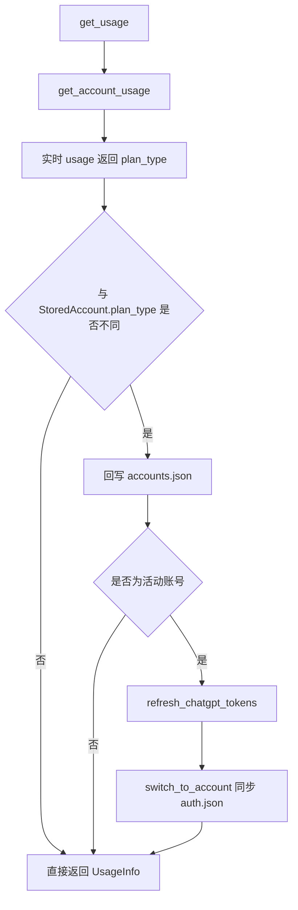

# 变更提案: sync-plan-type-metadata

## 元信息
```yaml
类型: 修复
方案类型: implementation
优先级: P1
状态: 已确认
创建: 2026-04-14
```

---

## 1. 需求

### 背景
当前账号在初次导入时会把当时的 `plan_type` 写入 `accounts.json`。后续如果该 ChatGPT 账号从 `free` 升级为 `plus`，后端 usage 接口已经能从实时接口拿到最新 `plan_type=plus` 和周限额，但本地账号元数据没有被回写，导致前端账号卡继续显示旧套餐；活动账号写回 `~/.codex/auth.json` 时也继续沿用旧 token/旧元数据，进一步放大了显示不一致问题。

### 目标
- 以实时 usage 返回的套餐类型为准，自动同步本地账号元数据。
- 对当前活动账号，在检测到套餐变化时尽量刷新并同步最新 token，使 `auth.json` 与最新套餐状态保持一致。
- 前端展示优先体现最新套餐状态，避免在一次刷新周期内仍显示旧值。

### 约束条件
```yaml
时间约束: 本次为现有仓库内的定向修复，不扩展无关功能
性能约束: 不引入高频额外网络请求；仅在检测到套餐变化时执行额外同步
兼容性约束: 保持现有 accounts.json 结构兼容，不破坏已有导入/切换流程
业务约束: API Key 账号不参与套餐同步逻辑，仍维持现有表现
```

### 验收标准
- [ ] 当 usage 接口返回的 `plan_type` 与本地账号不同步时，本地 `accounts.json` 会被自动更新，重新加载账号列表后展示最新套餐。
- [ ] 当前活动账号发生套餐变化时，会尽量同步最新 token / `auth.json`，前端状态和 CLI 可观察状态不再长期停留在旧套餐。
- [ ] 前端账号卡在本次刷新周期内优先展示最新 usage 套餐，不依赖下一轮全量 reload 才更新。

---

## 2. 方案

### 技术方案
在 Rust usage 链路中增加“套餐元数据同步”步骤：`get_account_usage` 成功拿到实时 usage 后，比较返回的 `plan_type` 与 `StoredAccount.plan_type`。若不同，则先回写 `accounts.json`；若该账号是当前活动账号，再额外触发一次 token refresh 流程，用新的 `id_token` / `access_token` 同步 `auth.json`，把 CLI 侧可见的套餐来源也拉到最新。前端账号卡片同时改为优先显示 `usage.plan_type`，保证界面在当前刷新周期内立即反映最新状态。

### 影响范围
```yaml
涉及模块:
  - tauri-commands: 通过现有 get_usage 刷新链路触发套餐同步
  - auth-switcher: 活动账号 token/auth 同步仍复用既有刷新与写回机制
  - frontend-app: 账号卡套餐显示逻辑改为优先使用实时 usage
预计变更文件: 5
```

### 风险评估
| 风险 | 等级 | 应对 |
|------|------|------|
| usage 刷新时触发额外 token refresh 造成不必要请求 | 中 | 仅在 ChatGPT 活动账号且检测到套餐变化时才触发 |
| usage 同步失败影响原有额度展示 | 中 | 元数据回写失败仅记录日志，不阻断 usage 返回 |
| 前端展示与持久化状态来源混用导致混淆 | 低 | 统一采用“实时 usage 优先，持久化字段兜底”的显示规则 |

---

## 3. 技术设计（可选）

### 架构设计


### API设计
N/A，复用现有命令接口。

### 数据模型
| 字段 | 类型 | 说明 |
|------|------|------|
| `StoredAccount.plan_type` | `Option<String>` | 持久化保存账号当前套餐类型 |
| `UsageInfo.plan_type` | `Option<String>` | 实时 usage 接口返回的套餐类型，前端优先展示 |

---

## 4. 核心场景

### 场景: 已导入账号后升级套餐
**模块**: `tauri-commands` / `frontend-app`
**条件**: 本地账号最初保存为 `free`，远端 usage 已返回 `plus`
**行为**: 用户刷新额度或应用自动刷新 usage
**结果**: 本地账号元数据自动更新为 `plus`，账号卡立即显示 `plus`

### 场景: 当前活动账号套餐升级
**模块**: `auth-switcher`
**条件**: 当前活动账号 usage 返回套餐变化，且活动 auth 仍沿用旧 token
**行为**: usage 同步检测到变化后触发一次 token refresh，并把最新 token 写回 `auth.json`
**结果**: 活动工作区和 CLI 可见状态尽量与最新套餐保持一致

---

## 5. 技术决策

### sync-plan-type-metadata#D001: 套餐变化以 usage 结果为真实来源并回写持久化元数据
**日期**: 2026-04-14
**状态**: ✅采纳
**背景**: `id_token` 中的套餐声明不会在账号升级后立即自动反映，但 usage 接口已经返回了最新套餐与限额。如果只依赖初次导入元数据或过期 token，前端和本地状态会长期停留在旧套餐。
**选项分析**:
| 选项 | 优点 | 缺点 |
|------|------|------|
| A: 仅前端显示使用 `usage.plan_type` | 改动小，界面立即修复 | 本地元数据仍旧，CLI / 后续流程继续失真 |
| B: 以 usage 结果回写本地元数据，并在活动账号上尝试刷新 token | 前后端状态更一致，可同时改善 UI 与活动 auth 同步 | 实现稍深，需要控制额外请求频率 |
**决策**: 选择方案 B
**理由**: 用户明确要求真实状态回写，目标不只是“页面看起来对”，而是要让本地状态与实时后端状态趋于一致。方案 B 才能同时解决前端展示滞后和活动账号状态长期陈旧的问题。
**影响**: 影响 `api/usage.rs` 的同步逻辑、`auth/storage.rs` 的元数据更新能力，以及前端账号卡套餐展示逻辑。

---

## 6. 成果设计

N/A。本次为状态同步修复，不涉及新的视觉设计产出。
