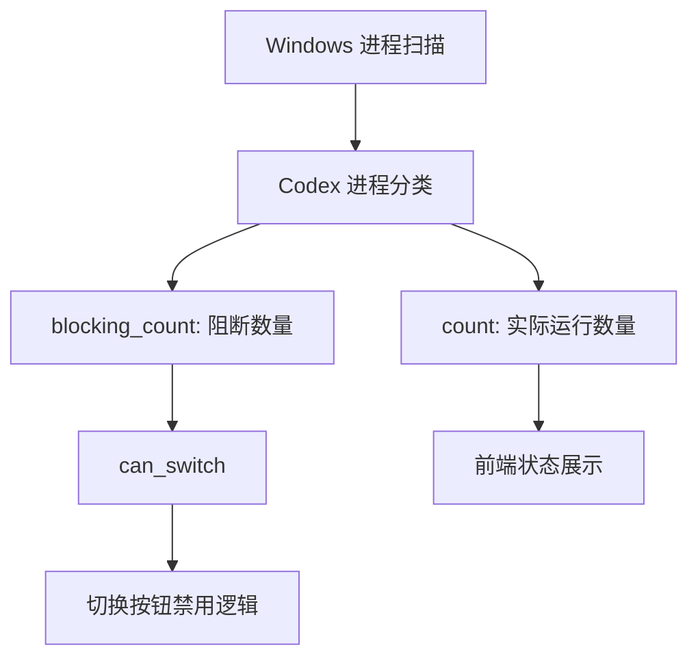

# 变更提案: fix-process-detection-display

## 元信息
```yaml
类型: 修复/优化
方案类型: implementation
优先级: P1
状态: 已确认
创建: 2026-04-14
```

---

## 1. 需求

### 背景
Windows 下当前正在使用 Codex CLI 与本会话交互时，Codex Switcher 仍显示“当前无阻塞进程”。现有后端仅按 `Codex.exe` 窗口/子进程树识别活跃实例，无法识别 `node.exe -> @openai/codex/bin/codex.js` 这类 CLI 进程；前端又把“检测到进程数量”和“是否应当阻止切换”混成同一个状态，导致显示和行为都容易误导用户。

### 目标
- 正确识别 Windows 下实际运行中的 Codex CLI 进程，并在前端展示真实数量。
- 将“运行中的 Codex 进程数量”和“是否需要阻止切换”拆分成两个语义，避免用户看到错误的“无阻塞进程”提示。
- 保持现有切换策略不变，不因为本次修复额外引入严格阻断。

### 约束条件
```yaml
时间约束: 本轮修复完成并验证后即可交付
性能约束: 进程扫描仍需维持轻量轮询，不能明显增加前端 3 秒轮询带来的系统负担
兼容性约束: 保持现有 Tauri 命令接口可平滑扩展，前端现有切换流程与账号管理逻辑不回退
业务约束: 不调整账号切换策略，只修复检测与展示误判
```

### 验收标准
- [ ] Windows 下存在 `node.exe -> @openai/codex/bin/codex.js` 形式的 Codex CLI 会话时，后端返回的运行中进程数量大于 0。
- [ ] 前端在检测到运行中 CLI 会话时显示真实进程数量，不再错误显示“当前无阻塞进程”。
- [ ] 当前只有 CLI 会话运行时，切换按钮行为保持既有策略，不因为数量修复被额外禁用。

---

## 2. 方案

### 技术方案
后端将 Windows 进程检测改为同时识别两类活跃会话：桌面版 `Codex.exe` 根进程树与 `node.exe`/兼容运行时承载的 Codex CLI 进程。命令返回结构新增 `blocking_count`，其中 `count` 表示实际运行中的 Codex 进程数量，`blocking_count` 表示应当阻止切换的进程数量，`can_switch` 则仅由 `blocking_count` 计算。前端使用 `count` 做状态展示，用 `can_switch` 控制是否禁用切换，避免把“进程存在”和“禁止切换”视为同一含义。

### 影响范围
```yaml
涉及模块:
  - tauri-commands: 调整进程检测结果结构与 Windows 识别逻辑
  - frontend-app: 调整页头与工作区状态面板文案、切换按钮禁用逻辑
预计变更文件: 4
```

### 风险评估
| 风险 | 等级 | 应对 |
|------|------|------|
| Windows 进程匹配条件过宽导致误报 | 中 | 使用明确的 `@openai/codex/bin/codex.js` 命令行特征并补单元测试 |
| 进程数量与禁用逻辑拆分后前端状态不一致 | 中 | 前端统一以 `count` 展示、`can_switch` 控制行为，并修复 `checkProcesses()` 返回值使用方式 |

---

## 3. 技术设计（可选）

> 涉及架构变更、API设计、数据模型变更时填写

### 架构设计


### API设计
#### Tauri Command: `check_codex_processes`
- **请求**: 无
- **响应**:
  ```ts
  {
    count: number;
    background_count: number;
    blocking_count: number;
    can_switch: boolean;
    pids: number[];
  }
  ```

### 数据模型
| 字段 | 类型 | 说明 |
|------|------|------|
| count | number | 实际运行中的 Codex 进程数量，包含可共存的 CLI 会话 |
| blocking_count | number | 需要阻止切换的进程数量 |
| can_switch | boolean | 是否可切换，仅由 `blocking_count === 0` 推导 |

---

## 4. 核心场景

> 执行完成后同步到对应模块文档

### 场景: Windows CLI 会话检测
**模块**: tauri-commands
**条件**: 用户正在 PowerShell 中运行 Codex CLI，会话由 `node.exe` 承载 `@openai/codex/bin/codex.js`
**行为**: 进程扫描识别该 CLI 会话并返回计数
**结果**: 前端展示真实运行数量，不再误报“无阻塞进程”

### 场景: 切换按钮语义分离
**模块**: frontend-app
**条件**: 检测到运行中的 CLI 会话，但当前策略仍允许切换
**行为**: 前端展示运行中的 Codex 进程数量，同时仅在 `can_switch=false` 时禁用切换
**结果**: 用户看到准确状态提示，但现有切换策略不被意外收紧

---

## 5. 技术决策

> 本方案涉及的技术决策，归档后成为决策的唯一完整记录

### fix-process-detection-display#D001: 分离运行数量与切换阻断语义
**日期**: 2026-04-14
**状态**: ✅采纳
**背景**: 用户只要求修复“实际使用中的 Codex 进程数量显示”，不希望因为检测修复而额外改变当前切换策略。现有实现把 `count==0` 直接等价为 `can_switch=true`，无法同时满足“显示真实数量”和“保持切换策略”两个目标。
**选项分析**:
| 选项 | 优点 | 缺点 |
|------|------|------|
| A: 继续让 `count` 决定 `can_switch` | 改动小 | 一旦修正 CLI 计数，就会把当前允许切换的行为误改成严格阻断 |
| B: 新增 `blocking_count`，拆分展示与禁用逻辑 | 同时满足真实展示与策略稳定 | 需要同步调整前后端类型 |
**决策**: 选择方案 B
**理由**: 该任务的核心是修正“显示误判”而不是调整“切换策略”，拆分语义是唯一不引入行为回归的实现方式。
**影响**: 影响 `process.rs`、前端类型定义以及状态面板/切换按钮使用方式

---

## 6. 成果设计

> 含视觉产出的任务由 DESIGN Phase2 填充。非视觉任务整节标注"N/A"。

N/A
